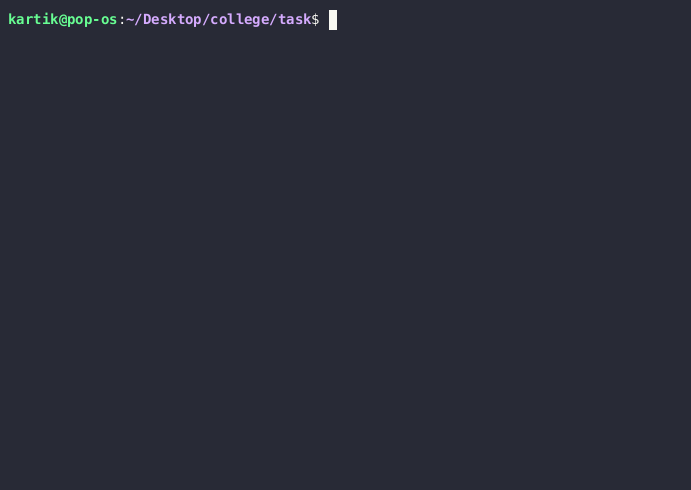

# Nymble - Task

The task given by nymble was to write MCU code to recieve data from PC using UART, store it in EEPROM, retrieve the data from EEPROM one-by-one and send it to back to PC.

I have chosen atmega328p to complete this task.

## Compilation and Testing

To compile and upload the atmega328p code, you can download this repo and open it using arduino-IDE. Afterwards, you can directly compile and upload the code by clciking on the small `->` button on top left corner.

The `mon.py` file in this repo can be used to send data using UART to arduino. I have used curses and pyserial library to  provide visual feedback on console and using Serial respectively.

This code has been confirmed working on linux(Pop! OS), python3 and an Arduino nano.

## Demo

## Challenges faced

* Initially I faced problems with UART packets dropping with higher baud rates, I was able to rectify it by using a circular queue and interrupts. However, since the task only required me to deal with a baudrate of `2400`, I have removed the interrupt and circular queue code to cleanup the code a bit.

* Although I was able to calculate RX/TX rate by using Timer0 on the board itself, sending the info back to PC would cause incoming UART packets to drop. I might have been able to overcome this issue if I started the timer0 once UART started recieving data and stopped it once all data had been recieved but from what I understood, the requirements necessited that transmission rate should be sent back for *every* byte that had been recieved which would be slow and cause packets to drop anyways. One other solution to this could have been to start a second UART connection, however atmega328p only supports single UART (Hardware). In the end, I have relied on the python script to calculate the serial communication speed.
